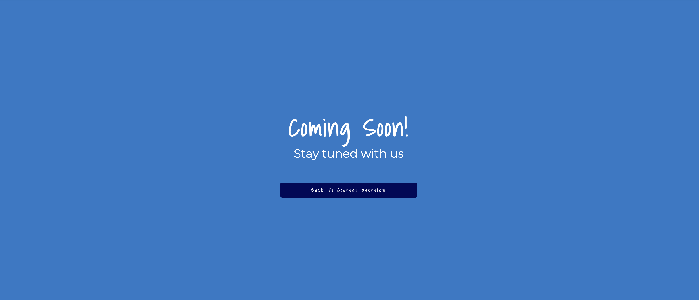

# Kids English Club
Kids English Club, a fantastic English tuition school which has been running successfully for two years in a promising town of Narathiwat with amazing local feedback, support and interest, has now launched its very first website to showcase its great successes and product ranges. With reasons why learn with us and courses detail at hand, existing and prospective customers can easily reach out to the school with a click of a button.  

The learning style is portrayed throughout the entire website for being fun and interactive with activities based learning that is promised to bring great and hidden potential out from all children. There are even links for social media and even an interactive map to help easily locating the school. 

[View Kids English Club live project here](https://whon1980-dl.github.io/kids-english-club/)

- - -

## Table of Contents

### [User Experience (UX)](#user-experience-ux-1)
* [User Stories](#user-stories)
### [Features](#features)
* [Existing Features](#existing-features)
### [Features Left to Implement](#features-left-to-implement-1)
### [Design](#design-1)
### [Technologies Used](#technologies-used-1)
### [Frameworks, Libraries & Programs Used](#frameworks-libraries--programs-used-1)
### [Testing](#testing-1)
* [Validation Results](#validation-results)
* [Manual Testing](#manual-testing)
* [Lighthouse Report](#lighthouse-report)
### [Deployment and local development](#deployment-and-local-development-1)
* [GitHub Pages](#github-pages)
* [Forking the GitHub Repository](#forking-the-github-repository)
* [Local Clone](#local-clone)
### [Credits](#credits-1)
### [Acknowledgements](#acknowledgements-1)
---

## User Experience (UX)

This website is meant to provide up-to-date information and point of contact for existing customers and attract prospective customers who are parents looking for great and fun place for their children to learn English. 

There is a clear slogan of delivering English learning with fun, great reasons for why learn with the school, courses detail and furthermore a form for making further enquiry easy. 

User can also view gallery of images that showcase the great atmosphere of each lesson taught. 

The clear navigation of the website will contribute to an enjoyable experience when exploring the website. 

### User Stories

* First-time visitor goals
    * Understand the main purpose of the site and learn more about the Kids English Club school.
     * Easily navigate throughout the whole site.
     * Be drawn to responsive design that allow for enjoyable experience when accessing the site from any devices.
     * Be urged to explore more with feedback on all links and buttons 
     * Find the enquiry form to leave detail to be contacted back and ask further questions. 

* Returning visitors goals
    * Find out new update about courses provided and the school
    * Locate contact information and send enquiry.
    * Review the site's extensive gallery.

* Frequent user goals
    * Check if there are any new available courses that may better suit the change of need of their children.
    * Review the gallery for any new added photos of their love ones. 
- - -

## Features

* This website is targeting parents who regard fun and activities-based learning as the best way to bring great potential in developing English language skill out of their children.
* They can do that by exploring the site and reach out to the school using the contact page and locate the school with the help of the provided map on the contact page. 

### Existing Features

* Navigation bar 
    * It is featured and fixed on all the pages.
    * The logo and school name is a link to allow for homepage returning navigation
    * the menu bar also includes link to about us section, courses, gallery and contact page that gives indication of which page the user is at. 
    * It is identical in design across the pages.
    * Allows easy navigation from page without having to revert back to the previous page via the "back" button of a browser.

* The landing page image
    * The landing includes a photograph, of a little boy who was concentrating and enjoying what he was learning to do, with text overlay to let user immediately see as the fist message of the site that learning with the school is all about fun! 
    * This section introduce the user to have the urge to find out more how they can get the attention of their little ones to focus on learning, with an adoring image to grab their attention. 

* About Us Section
    * This section welcome user to the site with an image of a caring teacher and a warm welcoming message that will allow the user to see unique ways in which their little ones will be taught at the school.
    * The user will again feel that their little ones will be well looked after and understood. 

 

* School Ethos Section
    * The school ethos section will allow the user to see the benefits of enrolling their children with the school.
    * The three primary reasons are highlighted very clearly in each colourful info box. 

* Courses Overview Section
    * This section will allow user to see what are the available courses that are currently taught by the school with information regarding the day the courses are taught, time when each course is taught and suitable age range for the courses for parents to decide which is the most suitable one.
    * The section also contain link for user who want to find out more about each courses where clicking it will lead to a site that is coming soon. 
    * The section will be updated as new courses become available in the near future. 
    * The images use, once again emphasise the fun and stress free learning and interactive approach of teaching method. 

* Courses Detail Page
    * By clicking on find out more button link the user will be directed to a coming soon page where the detail will be added in the near future and advise them to revisit.
    * This page also provides a back to courses preview button for easy navigation back to courses preview again and has a call to action feature. 

* Thinking Kid Section
    * This section draw attention upon site user with a picture of a curious young mind that will constantly want to explore the new world and that a skill in language can add to the ability to do that.
    * The image is display as circular to make it stand out and draw extra attention. 

* Quote and Link to Gallery
    * This part display a very meaningful quote to lift up the mood of the user to the next level.
    This part also itself is a link with a call-to-action feature for the user who want to visit the site gallery page to see more smile.

* Testimonials Section
    * This section allow user to see the genuine and sincere testimonials that has been written for the school and how happy they were with the result they can see in their children development with the school. 
    * This section will also help them to make up their mind about choosing the school. 

* The Footer
    * The footer section includes links to the relevant social sites for Kids English Club. The links will open to a new tab to allow easy navigation for the user.
    * The footer is valuable to the user as it encourage them to keep connected via social media. 

* Picture-Gallery
    * The gallery will provide the user with support images to see the school classoom ambient and atmosphere, happy students and caring teachers as well as interactive approach of the school teaching method.
    * This page is valuable to the user as they will be able to see the existing feel of the school that will reassure them of the safe and caring environment that the school provides. 

* The Contact Page
    * This page will allow the user to leave their detail and question they would like to ask further question about the school and courses. The user will be asked to submit their full name, phone number, email address and message.
    * By sending the enquiry form the user will be directed to an acknowledgement page that will reassure user that their form is received and that the school will get back to them as soon as possible. 
    * This page also provides an interactive google map to allow user to easily locate the school as well as providing the school address, phone number and email address. 
    * The angry boy image that is use on the page will allow user to see that school do understand all type of children emotion and that a struggle children will be fully supported at the school. 

* The Achknowlede Page
    * This page allows user to see that their enquiry has been recieved and to be reassured that the school will get back to them.
    * This page also provides back to contact button, wiht call-to action feature, in case user want to go back to the contact page to futher explore the map and address detail. 

!